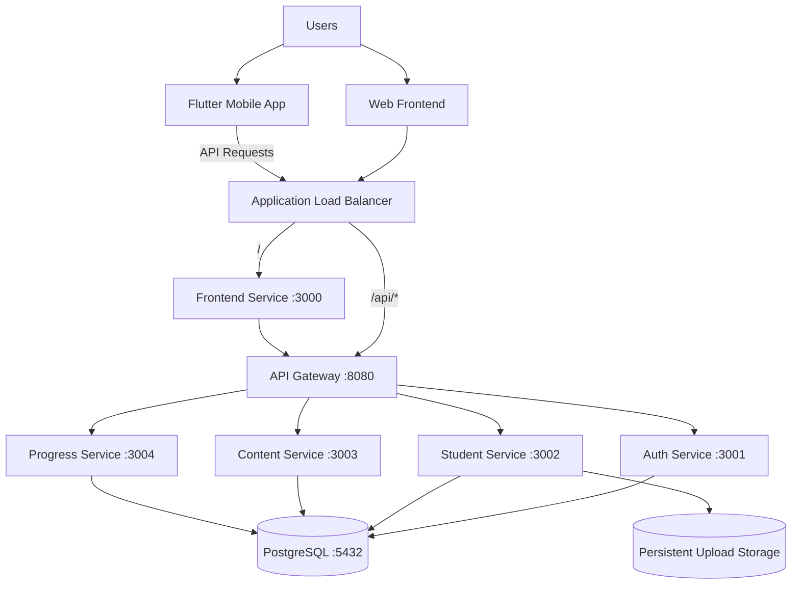
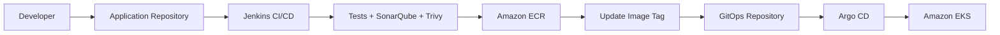
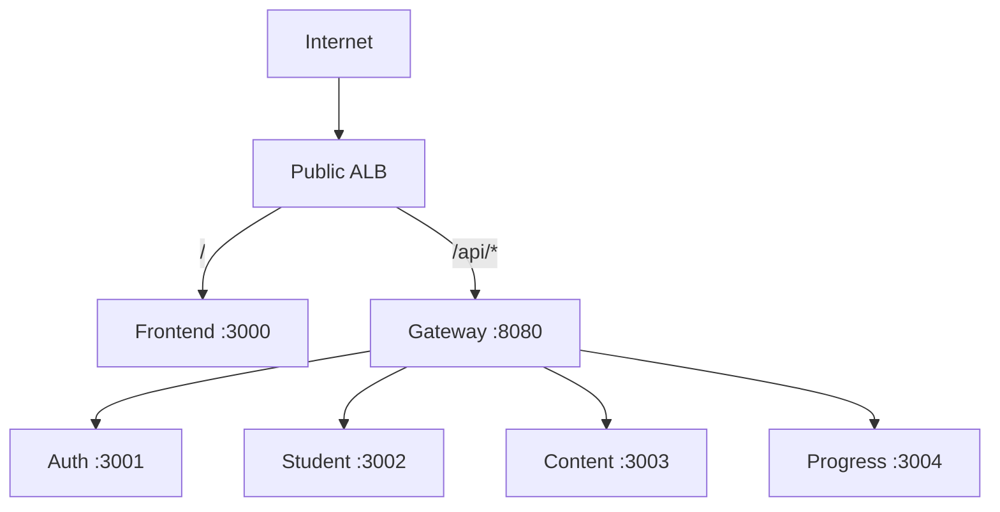

# 🚀 Physics Platform GitOps

> GitOps repository for deploying the **Physics Learning Platform** to Kubernetes using **Kustomize** and **Argo CD**.

This repository contains the desired Kubernetes state for the platform. Application source code lives in the application repository, while this repository is responsible for deployment configuration, environment overlays, image versions, storage, scheduling, and ingress.

---

## 📌 Repository Purpose

The deployment model is based on GitOps:

```text
Application Repository
        │
        │ CI builds images
        ▼
Amazon ECR
        │
        │ CI updates image tags
        ▼
GitOps Repository
        │
        ▼
     Argo CD
        │
        ▼
   Kubernetes / EKS
```

The CI pipeline does **not** need to deploy directly to Kubernetes.

Instead:

1. CI builds and scans application images.
2. Images are pushed to the container registry.
3. CI updates the image tag in this repository.
4. Argo CD detects the Git change.
5. Argo CD synchronizes the desired state to Kubernetes.

This keeps **Git as the source of truth** for application deployment.

---

# 🏗️ Platform Architecture

The platform has two user-facing clients:

- **Web Frontend**
- **Flutter Mobile Application**

The Flutter application is not deployed by this repository. It consumes the same public API exposed by the Kubernetes platform.



---

# 🧩 Kubernetes Workloads

| Component | Kubernetes Type | Port | Purpose |
|---|---|---:|---|
| Frontend | Deployment | `3000` | Browser UI |
| Gateway | Deployment | `8080` | Public API entry point |
| Auth Service | Deployment | `3001` | Authentication and users |
| Student Service | Deployment | `3002` | Students, subscriptions, uploads |
| Content Service | Deployment | `3003` | Chapters, lessons, exercises |
| Progress Service | Deployment | `3004` | Progress and lesson unlocking |
| PostgreSQL | StatefulSet | `5432` | Persistent relational database |

---

# 📂 Repository Structure

```text
physics-platform-gitops/
│
└── k8s/
    │
    ├── base/
    │   ├── namespace.yaml
    │   ├── kustomization.yaml
    │   │
    │   ├── auth/
    │   │   ├── deployment.yaml
    │   │   ├── service.yaml
    │   │   ├── configmap.yaml
    │   │   └── secret.yaml
    │   │
    │   ├── student/
    │   │   ├── deployment.yaml
    │   │   ├── service.yaml
    │   │   ├── configmap.yaml
    │   │   └── pvc.yaml
    │   │
    │   ├── content/
    │   │   ├── deployment.yaml
    │   │   ├── service.yaml
    │   │   └── configmap.yaml
    │   │
    │   ├── progress/
    │   │   ├── deployment.yaml
    │   │   ├── service.yaml
    │   │   └── configmap.yaml
    │   │
    │   ├── gateway/
    │   │   ├── deployment.yaml
    │   │   ├── service.yaml
    │   │   └── configmap.yaml
    │   │
    │   ├── frontend/
    │   │   ├── deployment.yaml
    │   │   ├── service.yaml
    │   │   └── configmap.yaml
    │   │
    │   └── postgres/
    │       ├── statefulset.yaml
    │       ├── service.yaml
    │       ├── headless-service.yaml
    │       ├── configmap.yaml
    │       ├── secret.yaml
    │       ├── init-job.yaml
    │       └── kustomization.yaml
    │
    └── overlays/
        │
        ├── minikube/
        │   ├── kustomization.yaml
        │   └── patches/
        │
        └── eks/
            ├── kustomization.yaml
            ├── ingress.yaml
            │
            ├── storage/
            │   └── gp3-stateful.yaml
            │
            └── patches/
                ├── postgres-statefulset.yaml
                ├── student-uploads-pvc.yaml
                └── application-nodes.yaml
```

> File names can evolve as the platform grows, but the design remains: **reusable base manifests + environment-specific overlays**.

---

# 🧱 Kustomize Design

The repository uses Kustomize to avoid duplicating complete Kubernetes manifests between environments.

```text
                  k8s/base
                     │
          ┌──────────┴──────────┐
          │                     │
          ▼                     ▼
 overlays/minikube        overlays/eks
          │                     │
          ▼                     ▼
 Local Kubernetes          Amazon EKS
```

The base defines common application resources.

Environment overlays define infrastructure-specific behavior such as:

- StorageClass.
- Image registry and tags.
- Node scheduling.
- Ingress.
- Cloud-specific configuration.

---

# 🖥️ Base Manifests

The `base` directory contains configuration shared across Kubernetes environments.

Typical resources include:

```text
Namespace
Deployments
StatefulSet
ClusterIP Services
ConfigMaps
Secrets
PVCs
Health Probes
Resource Requests / Limits
Security Contexts
```

The base should remain as environment-neutral as possible.

---

# 🧪 Minikube Overlay

The Minikube overlay is used for local Kubernetes development and testing.

Render it:

```bash
kubectl kustomize k8s/overlays/minikube
```

Apply it:

```bash
kubectl apply -k k8s/overlays/minikube
```

Example local flow:

```text
Developer
   │
   ▼
Minikube
   │
   ├── Frontend
   ├── Gateway
   ├── Microservices
   └── PostgreSQL
```

---

# ☁️ Amazon EKS Overlay

The EKS overlay contains AWS-specific configuration.

It is responsible for things such as:

- Amazon ECR image locations.
- Immutable image tags.
- EBS-backed storage.
- Node scheduling.
- AWS Load Balancer Controller Ingress.
- Application workload placement.

Render:

```bash
kubectl kustomize k8s/overlays/eks
```

Validation without applying:

```bash
kubectl kustomize k8s/overlays/eks > /tmp/physics-platform-eks.yaml
```

When Argo CD owns the deployment, normal changes should **not** be deployed manually with `kubectl apply`.

---

# 📦 Container Images

Application images are built outside this repository.

Services:

```text
physics-auth
physics-student
physics-content
physics-progress
physics-gateway
physics-frontend
```

For EKS, Kustomize replaces local image names with ECR repositories.

Example:

```yaml
images:
  - name: physics-auth
    newName: <aws-account>.dkr.ecr.<region>.amazonaws.com/physics-platform/auth
    newTag: <immutable-tag>
```

Recommended production tags:

```text
Git commit SHA
```

Example:

```text
a1b2c3d
```

instead of:

```text
latest
```

This allows every Kubernetes deployment to be traced back to the exact source revision that produced the image.

---

# 🔄 GitOps Deployment Flow



For the web/backend platform:

```text
Git Push
   ↓
Jenkins
   ↓
Unit Tests
   ↓
SonarQube Quality Gate
   ↓
Trivy Filesystem Scan
   ↓
Docker Build
   ↓
Trivy Image Scan
   ↓
Push to ECR
   ↓
Update kustomization.yaml
   ↓
git push
   ↓
Argo CD
   ↓
EKS
```

---

# 📱 Flutter Mobile Application

The Flutter client follows a separate CI/CD path.

It is **not deployed by Argo CD**.

```text
Flutter Source
    ↓
GitHub Actions
    ↓
GitHub-hosted Runner
    ↓
flutter analyze
    ↓
flutter test
    ↓
Build APK / AAB
    ↓
Signing
    ↓
Mobile Release
```

The Flutter application communicates with the backend through:

```text
/api/*
```

Therefore, Kubernetes and GitOps manage the backend/API platform, while GitHub Actions manages mobile builds and releases.

---

# 🤖 Argo CD

Argo CD continuously compares this repository with the Kubernetes cluster.

Example Application:

```yaml
apiVersion: argoproj.io/v1alpha1
kind: Application

metadata:
  name: physics-platform
  namespace: argocd

spec:
  project: default

  source:
    repoURL: https://github.com/ahmedrabe33/physics-platform-gitops.git
    targetRevision: main
    path: k8s/overlays/eks

  destination:
    server: https://kubernetes.default.svc
    namespace: physics-platform

  syncPolicy:
    automated:
      enabled: true
      prune: true
      selfHeal: true

    syncOptions:
      - CreateNamespace=true
      - PruneLast=true
```

---

## Automatic Sync

With automated sync enabled:

```text
Git Change
    ↓
Argo CD detects OutOfSync
    ↓
Automatic Sync
    ↓
Kubernetes updated
    ↓
Application returns to Synced / Healthy
```

Useful command:

```bash
kubectl get applications -n argocd
```

Expected state:

```text
NAME               SYNC STATUS   HEALTH STATUS
physics-platform   Synced        Healthy
```

---

## Self-Healing

If a managed Kubernetes object is modified manually:

```text
Desired State in Git
        │
        ▼
Actual Cluster State changed manually
        │
        ▼
Argo CD detects drift
        │
        ▼
Self-Heal
        │
        ▼
Cluster restored to Git state
```

For this reason, normal production changes should go through Git.

---

# 🌐 Ingress & Public Routing

On EKS, traffic can enter through AWS Load Balancer Controller.

```text
Internet
   │
   ▼
Application Load Balancer
   │
   ├── /       → frontend:3000
   │
   └── /api/*  → gateway:8080
```

Example architecture:



Backend microservices remain internal `ClusterIP` services.

---

# 💾 EKS Storage

AWS EBS CSI can provide persistent storage for stateful workloads.

Example StorageClass:

```yaml
apiVersion: storage.k8s.io/v1
kind: StorageClass

metadata:
  name: gp3-stateful

provisioner: ebs.csi.aws.com

parameters:
  type: gp3
  encrypted: "true"

reclaimPolicy: Retain

allowVolumeExpansion: true

volumeBindingMode: WaitForFirstConsumer
```

---

## PostgreSQL

PostgreSQL runs as a StatefulSet.

```text
PostgreSQL Pod
      │
      ▼
volumeClaimTemplate
      │
      ▼
PVC
      │
      ▼
gp3-stateful
      │
      ▼
Amazon EBS
```

The EKS overlay can patch PostgreSQL to use the cloud StorageClass.

---

## Student Uploads

The Student Service currently uses persistent storage for uploaded payment proof files.

```text
Student Service
      │
      ▼
student-uploads-pvc
      │
      ▼
gp3-stateful
      │
      ▼
Amazon EBS
```

A future production improvement is moving uploads to object storage such as Amazon S3.

---

# 🧠 Workload Scheduling

The EKS design separates stable/stateful workloads from dynamically scaled application workloads.

```text
Managed Nodes
    │
    ├── PostgreSQL
    └── Persistent / stateful workloads

Karpenter Application Nodes
    │
    ├── Auth
    ├── Content
    ├── Progress
    ├── Gateway
    └── Frontend
```

Example application selector:

```yaml
nodeSelector:
  workload: application
```

PostgreSQL example:

```yaml
nodeSelector:
  workload: stateful
```

This allows application capacity to scale separately from persistent workloads.

---

# 🔐 Secrets

Kubernetes workloads reference Kubernetes Secrets using `secretKeyRef`.

Example:

```yaml
env:
  - name: POSTGRES_USER
    valueFrom:
      secretKeyRef:
        name: postgres-secret
        key: POSTGRES_USER
```

Typical secrets include:

```text
postgres-secret
├── POSTGRES_USER
└── POSTGRES_PASSWORD

auth-secret
└── JWT_SECRET
```

> Kubernetes Secrets are not a substitute for a dedicated production secrets manager. For production hardening, consider SOPS, Sealed Secrets, or an external secrets manager.

Never expose secret values in README files, CI logs, pull requests, or screenshots.

---

# ❤️ Health & Availability

Application workloads define Kubernetes probes.

Typical health endpoint:

```text
/health
```

Example:

```yaml
readinessProbe:
  httpGet:
    path: /health
    port: 3001

livenessProbe:
  httpGet:
    path: /health
    port: 3001
```

The Gateway also provides a health endpoint that can be used by the public load balancer.

---

# 🔒 Deployment Security

The deployment configuration follows container security practices such as:

```yaml
securityContext:
  runAsNonRoot: true
  allowPrivilegeEscalation: false

  capabilities:
    drop:
      - ALL
```

Other security principles:

- Internal services use `ClusterIP`.
- Only required entry points are public.
- Immutable application image tags are preferred.
- CI performs vulnerability scanning before promotion.
- Jenkins does not need direct EKS deployment permissions.
- Argo CD is the Kubernetes deployment mechanism.
- AWS IAM should follow least privilege.

---

# 🚀 Updating an Application Version

Normal production flow:

```text
DO NOT:
kubectl set image ...
kubectl apply -k ...

DO:
Application commit
      ↓
CI pipeline
      ↓
New immutable image
      ↓
GitOps image tag update
      ↓
Argo CD
```

Example GitOps image update:

```yaml
images:
  - name: physics-gateway
    newName: <registry>/physics-platform/gateway
    newTag: a1b2c3d
```

Commit:

```bash
git add k8s/overlays/eks/kustomization.yaml

git commit -m "Deploy gateway a1b2c3d"

git push origin main
```

Argo CD handles deployment.

---

# ↩️ Rollback

GitOps makes rollback a Git operation.

Find deployment commits:

```bash
git log --oneline
```

Revert a deployment:

```bash
git revert <commit>
git push origin main
```

Then:

```text
Git Revert
    ↓
Argo CD
    ↓
Previous image/config restored
```

This provides a clear deployment history and audit trail.

---

# 🧪 Validation

Before pushing Kubernetes configuration:

```bash
kubectl kustomize k8s/overlays/eks > /tmp/rendered.yaml
```

A successful command confirms Kustomize can render the environment.

For Minikube:

```bash
kubectl kustomize k8s/overlays/minikube > /tmp/minikube-rendered.yaml
```

---

# 🔍 Useful Commands

## Argo CD

```bash
kubectl get applications -n argocd
```

```bash
kubectl describe application physics-platform -n argocd
```

## Application

```bash
kubectl get pods -n physics-platform
```

```bash
kubectl get svc -n physics-platform
```

```bash
kubectl get ingress -n physics-platform
```

```bash
kubectl get pvc -n physics-platform
```

## Scheduling

```bash
kubectl get pods -n physics-platform -o wide
```

```bash
kubectl get nodes \
  -L workload,karpenter.sh/nodepool,node.kubernetes.io/instance-type
```

## Storage

```bash
kubectl get pv
```

```bash
kubectl get pvc -n physics-platform
```

## Logs

```bash
kubectl logs deployment/gateway \
  -n physics-platform
```

---

# 🐞 Troubleshooting

## Argo CD Shows `OutOfSync`

Check:

```bash
kubectl describe application physics-platform -n argocd
```

Validate Kustomize:

```bash
kubectl kustomize k8s/overlays/eks
```

---

## `ImagePullBackOff`

Check:

```bash
kubectl describe pod <pod-name> -n physics-platform
```

Verify:

- Image repository.
- Image tag.
- Registry permissions.
- ECR repository exists.
- Node IAM permissions.

---

## `Pending` PVC

Check:

```bash
kubectl get pvc -n physics-platform
```

```bash
kubectl describe pvc <pvc-name> -n physics-platform
```

Verify:

- StorageClass exists.
- EBS CSI driver is running.
- Pod scheduling constraints.
- Availability Zone compatibility.

---

## Pod Scheduling Problems

Check:

```bash
kubectl describe pod <pod-name> -n physics-platform
```

```bash
kubectl get nodes --show-labels
```

Verify selectors such as:

```text
workload=stateful
workload=application
```

---

# 🛡️ GitOps Rules

Recommended operating rules:

1. **Git is the source of truth.**
2. Do not deploy production application changes manually.
3. Use immutable image versions.
4. Validate Kustomize before merging.
5. Require pull-request review for production changes.
6. Let Argo CD perform synchronization.
7. Roll back using Git history.
8. Keep environment-specific configuration in overlays.
9. Keep common Kubernetes resources in `base`.
10. Never expose production credentials in repository history.

---

# 🔄 Repository Responsibilities

## Application Repository

Responsible for:

```text
Application source
Dockerfiles
Unit tests
Jenkinsfile
Flutter source
GitHub Actions
```

Repository:

```text
https://github.com/ahmedrabe33/physics-platform-app
```

---

## GitOps Repository

Responsible for:

```text
Kubernetes desired state
Kustomize base
Environment overlays
Container image versions
Ingress
Storage configuration
Scheduling rules
Deployment history
```

Repository:

```text
https://github.com/ahmedrabe33/physics-platform-gitops
```

---

# 🎯 Project Goals

This repository demonstrates practical experience with:

- GitOps.
- Argo CD.
- Kubernetes.
- Kustomize.
- Amazon EKS.
- Amazon ECR.
- AWS Load Balancer Controller.
- Amazon EBS CSI.
- Persistent storage.
- Stateful workloads.
- Application scheduling.
- Karpenter integration.
- Immutable container releases.
- Deployment automation.
- Rollback through Git.
- Environment overlays.
- CI/CD separation of responsibilities.

---

# 🛣️ Roadmap

```text
Reusable Kubernetes Base
    ✅

Minikube Overlay
    ✅

EKS Overlay
    ✅

EBS Storage
    ✅

Public Ingress / ALB
    ✅

Argo CD
    ✅

Automated GitOps Sync
    ✅

Jenkins → GitOps Integration
    ◉

Immutable SHA Image Tags
    ◉

Terraform Infrastructure
    ◉

Ansible Configuration
    ◉

Production Secret Management
    ⏳

Monitoring
    ⏳

Centralized Logging
    ⏳

HTTPS / Domain
    ⏳

Object Storage for Uploads
    ⏳
```

Legend:

```text
✅ Implemented / validated
◉ In active development
⏳ Planned / hardening
```

---

# 👨‍💻 Author

**Ahmed Rabie**

DevOps / Cloud Engineer

GitHub:

```text
https://github.com/ahmedrabe33
```

---

## ⭐ Support

If you find this project useful, consider giving the repositories a star ⭐.
